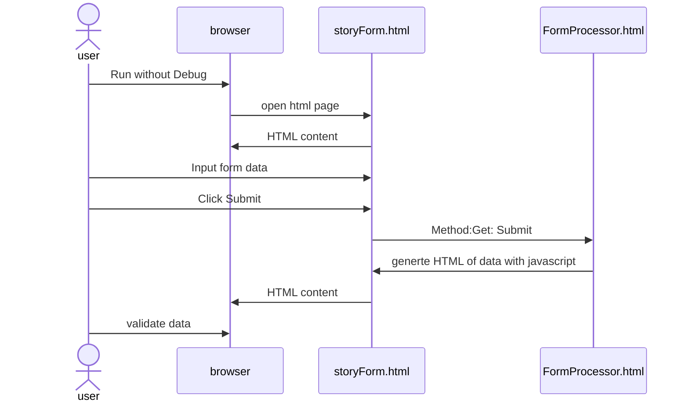
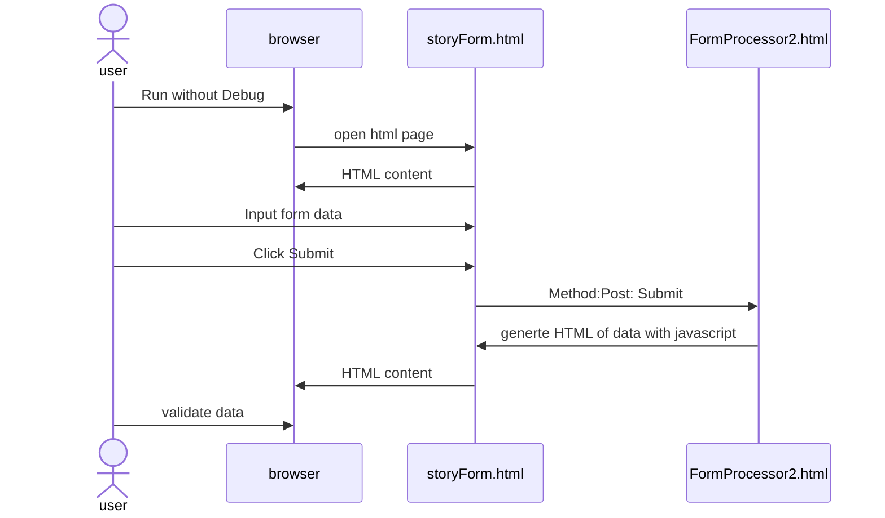

# Challenge Me

The following diagram is created with [Mermarid](https://mermaid.ai/open-source/ecosystem/tutorials.html) text to diagram aka diagram-as-code.

## Sequence diagram of practical

### HTTP GET (FormProcessor.html)

### HTTP GET (FormProcessor2.html) - Beautify Response

## Questions

1. What's the character limit for input text field?
2. How do you do email validation?
3. How to you ensure only numbers input and length limit in contact number?
4. Suggest improvement for URL link input?
5. What sort of age validation would you incorpportate?
6. What sort of encoding being used for URL in 'get' method?
7. Why is the URL encoded in 'get' method?
8. When you 'Run without debug', the url in browser shows <http://127.0.0.1>, what does this means?

## improve development experience in vscode

- [VSCode Tips](vscode-tips.md)

## Using httpbin

What is httpbin? it is a server that echo back everything you sent it, more [details](https://kennethreitz.org/software/websites/httpbin). Useful for debugging and testing and understanding what's being sent over http to the server.

- change the action to `https://httpbin.org/get` with method: `get`, take note of the returns result
- change the action to `https://httpbin.org/post` with method: `post`, take note of the returns result

compare the output of both, if shows information of data submitted in different place and information of user's browser and location (IP address).
